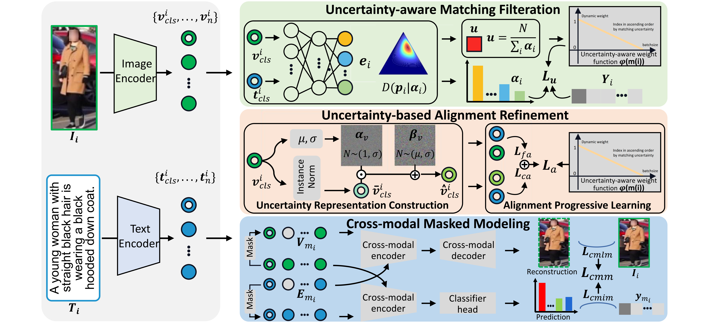
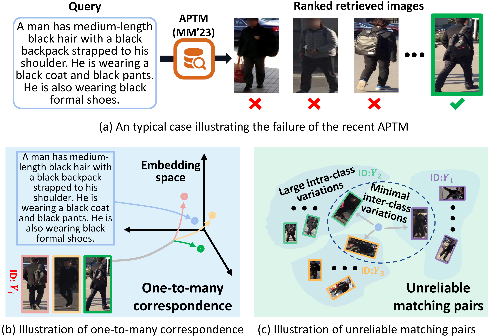
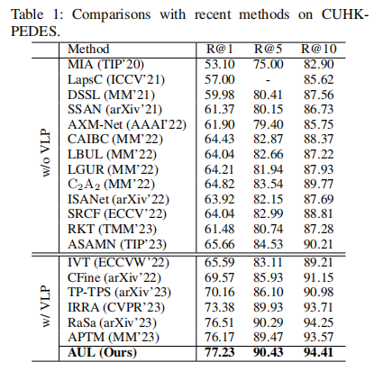

## Introduction
This is the source code of "Adaptive Uncertainty-based Learning for Text-Based Person
Retrieval"

## Adaptive Uncertainty-based Learning for Text-Based Person Retrieval
Our AUL model comprises three components: 1) Uncertainty-aware Matching Filtration that leverages Subjective Logic that can effectively mitigate the disturbance of unreliable matching pairs and select high-confidence cross-modal matches for training; 2) Uncertainty-based Alignment Refinement, which not only simulates coarse-grained alignments by constructing uncertainty representations, but also performs progressive learning to incorporate coarse- and fine-grained alignments properly; 3) Cross-modal Masked Modeling that aims at exploring more comprehensive relations between vision and language.

## Proposed Model (AUL)
* Uncertainty-aware Matching Filtration
* Uncertainty-based Alignment Refinement
* Cross-modal Masked Modeling

## Motivation

Illustrative examples of existing problems: (a) An representative failure case of the recent state-of-the-art method APTM. (b) Unreliable matching pairs that stem from large intra-class variation and minimal inter-class variation. (c) The presence of one-to-many correspondence is evident.

## Results

## Retrieval Examples

## Usage
* Download the CUHK-PEDES dataset, ICFG-PEDES dataset and RSTPReid dataset
* Run run.sh

